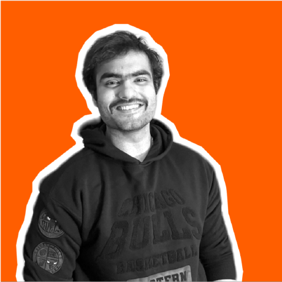

<p align="center">
  
</p>

<p align="center">
  <a href="https://linkedin.com/in/karan-badlani">
    
  </a>
  <a href="https://github.com/Johnny001-DS">
    
  </a>
  <a href="mailto:karanbadlani001@gmail.com">
    
  </a>
</p>

## About

I am Karan Badlani, a data scientist and machine-learning builder focused on turning messy real-world data into useful decision systems. My work sits at the intersection of applied ML, retrieval-augmented generation, healthcare analytics, financial forecasting, and cloud-native AI applications.

```python
class KaranBadlani:
    role = "Data Scientist | ML Engineer | GenAI Builder"
    location = "United States"

    current_focus = [
        "production-grade RAG systems",
        "healthcare NLP and recommendation workflows",
        "financial forecasting and risk signals",
        "LLM evaluation, retrieval quality, and cloud ML architecture",
    ]

    toolchain = {
        "languages": ["Python", "R", "SQL"],
        "ml": ["scikit-learn", "PyTorch", "TensorFlow", "UMAP", "KMeans"],
        "genai": ["RAG", "LangChain", "OpenAI", "Amazon Bedrock", "Qdrant", "FAISS"],
        "cloud": ["AWS", "GCP", "Docker", "FastAPI", "Streamlit"],
    }
```

## Featured Work

| Project | Direction | What it demonstrates |
| --- | --- | --- |
| [Healthcare RAG Bot](https://github.com/Johnny001-DS/Healthcare-RAG-Bot) | Healthcare GenAI | Bedrock-powered insurance document assistant with FAISS, S3, citations, and admin/user Streamlit apps. |
| [ProductionGradeRAGPythonApp](https://github.com/Johnny001-DS/ProductionGradeRAGPythonApp) | Production RAG | FastAPI, Inngest, Qdrant, OpenAI embeddings, Streamlit, and RAGAS evaluation in one RAG workflow. |
| [HealthCare Recommendation System](https://github.com/Johnny001-DS/HealthCare-Recommendation-System) | Healthcare ML | Patient archetype discovery with preprocessing, bias handling, UMAP, KMeans, stability checks, and explainable assignment. |
| Yield Curve Forecasting | Financial ML | Time-series forecasting and macro-risk signal modeling for economic downturn analysis. |
| Protein Function Prediction | Biotech ML | Deep-learning workflow for biological sequence/function modeling with TensorFlow. |

## Direction

I am especially interested in building AI systems that are measurable, explainable, and useful outside a notebook:

- Retrieval pipelines with source grounding, evaluation, and human-readable traceability.
- Healthcare analytics that turn high-dimensional patient data into interpretable segments.
- Forecasting systems for financial risk, market signals, and decision support.
- Cloud-native ML applications with clean interfaces, repeatable pipelines, and sensible monitoring.
- GenAI tools that combine strong UX with practical engineering: FastAPI, Streamlit, vector databases, orchestration, and evaluation.

## Stack

<p align="left">
  
  
  
  
  
  
  
  
  
  
  
  
  
  
  
</p>

## Current Build Mode

```bash
$ kb.focus --now
> sharpening RAG quality, healthcare ML explainability, and applied forecasting systems

$ kb.values
> clean data contracts
> grounded answers
> interpretable models
> production-minded interfaces
```

## GitHub Signal

<p align="left">
  
  <br />
  
  <br />
  
</p>
